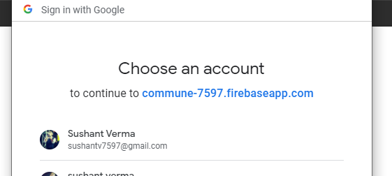
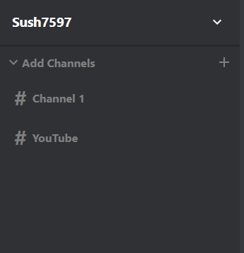
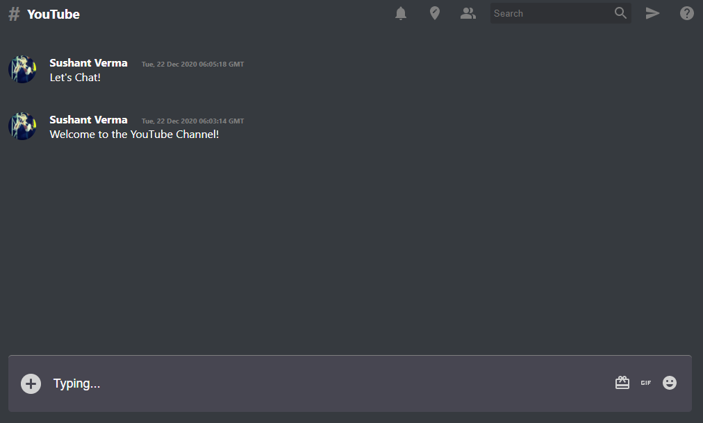
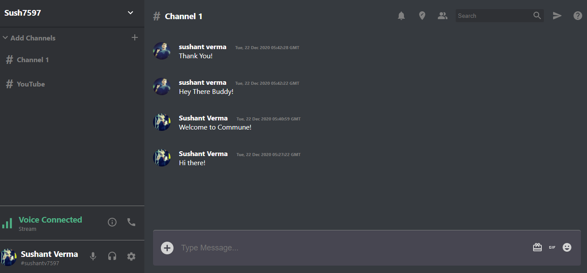

# Commune
React - Redux based Real-time Chatting app for communities.
(Inspired By Discord)

https://commune-7597.web.app/

# Features : 

  - Single Page Web Appilcation
  - LogIn using Google Sign In Method
  - Logout by clicking on Profile Pic
  - Complete Auth Management System
  - Real-Time Chatting with Community Members
  - Make Different Chat-Rooms / Channels
  - Chat Among various channels simultaneously
  - Automatically Import Profile data from Google
  - Firebase for Database Management and Hosting
  
# Screenshots : 

    -Sign-In

    -Creating New Channel

    -Channel List

    -Chatting Area

    -Complete HomePage

